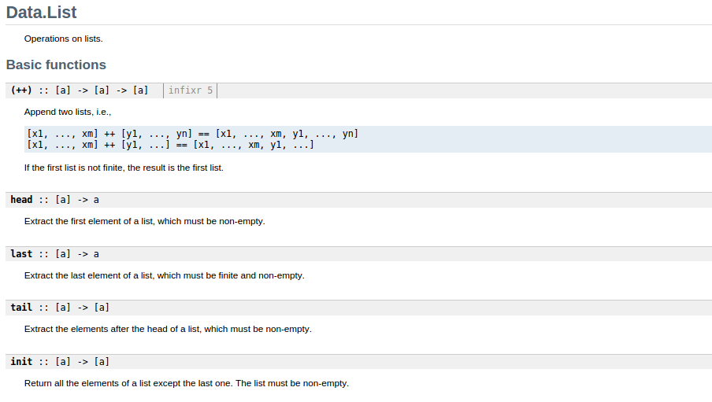
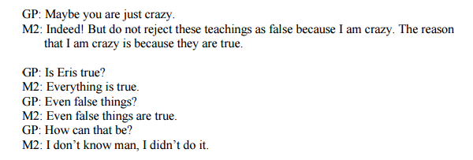

## Parametricity: The Essence of Information Hiding

[Kris Nuttycombe](http://github.com/nuttycom) -- [`@nuttycom`](http://twitter.com/nuttycom)

April 19, 2014

<http://github.com/nuttycom/lambdaconf-2015>

------

## About Me

- Introduced to Scala in 2008
- Discovered Scalaz in 2010
- Led Scala dev teams at Gaiam, Precog, & Simple Energy

- Finally started using Haskell for real work in 2014

------

## About This Talk

> - Mostly (very) introductory material
> - Some Haskell basics
>     - Types
>     - Universal & Existential Quantification
>     - What Parametricity Means
> - How to apply what we learn in Haskell to work we do in other languages

**Interrupt me!**

Because this is an introductory talk, I want it to be interactive.

At this point, ask for show of hands:

# who have experience with a functional programming language
# who have experience with a typed functional programming language
# who have experience with an OO language with parameterized types (generics)

So, what is a type?

------

## Types

> - A type is a set of possible values
> - e.g. 
>     - the type Bool is `{ True, False }`
>     - the type Int is `{ -2147483648, ..., 2147483647 }`

*Type* is purely a concern of static analysis.

If you write a piece of code, you have to reason about what
values are representable in that piece of code. This is true
about *every* programming language. You simply may not have
access to a program that helps you with that kind of reasoning.

And, in complete fairness, some terms are *hard* to type. Take
any example where some feature of a system determined at runtime
defines the operations that are available with respect to a value. 
ActiveRecord is a good example of this. 

------

# ∀

~~~{.haskell }

id :: ∀ a. a -> a

~~~

- `::` is pronounced "has type"
- `∀`  is pronounced (and may be written) `forall`

 

> - A type is a set of possible values
> - A type *variable* is the set of such sets.

------

> "Write down the definition of a polymorphic function on a piece of paper. Tell me its type, but careful not to let me see the function's definition. I will tell you a theorem that the function satisfies." --[Wadler, 1989](http://citeseerx.ist.psu.edu/viewdoc/download?doi=10.1.1.38.9875&rep=rep1&type=pdf)

------

## Simple Examples

~~~{.haskell }

asdf :: ∀ a. a -> a -> a
   
~~~

- The output value is one of the input values.
- We can't tell which one, but it will always be the same one.

------

## Simple Examples

~~~{.haskell }

asdf :: ∀ a b. a -> b -> a
   
~~~

- The value returned is the first argument to this function.
- The second argument is to this function is ignored entirely.

------

## Simple Examples

~~~{.haskell }

asdf :: ∀ a b. (a, b) -> a
   
~~~

- The value returned is the first element of the tuple.
- The second element of the tuple is ignored entirely.

This is obvious, right? This is the 'first' function, which just uncurries the
function on the former slide, which was 'const'.

------

> "Write down the definition of a polymorphic function on a piece of paper. Tell me its type, but careful not to let me see the function's definition. I will tell you a theorem that the function satisfies." --[Wadler, 1989](http://citeseerx.ist.psu.edu/viewdoc/download?doi=10.1.1.38.9875&rep=rep1&type=pdf)

*Note that this only says "I will tell you `a` theorem."*

------

~~~{.haskell }

asdf :: ∀ a b. (a -> b) -> [a] -> [b]
  
~~~

> - Every value in the output is obtained by applying the function provided to a
    member of the input.
> - *BUT* `List` gives us too much information.

- could reverse the result
- could just pick the n'th value from the list, apply the function, and
  repeat it indefinitely...

------

(and many more)

------

## Code Reuse

~~~{.haskell }

firsts :: ∀ a b. [(a, b)] -> [a]
firsts xs = asdf fst xs
-- firsts = asdf fst 
  
~~~

- This is both excessively restrictive (must provide a list), and the type opens
  up more possibilities than we really want.

This is just a small motivating example.

If `List` gives us too much information, how can we recover generality?
To start with, remember that 

------

## Typeclasses

~~~{.haskell }

class Functor f where
  fmap :: ∀ a b. (a -> b) -> f a -> f b
  
instance Functor List where
  fmap :: ∀ a b. (a -> b) -> [a] -> [b]
  fmap f [] = []
  fmap f x : xs = f x : fmap f xs
  
~~~

------

## Laws

~~~{.haskell }

-- | asdf, qualified by a couple of properties
--
-- >>> asdf (xs ++ ys) == asdf xs ++ asdf ys
--
-- >>> asdf (asdf xs) == xs
--
asdf :: ∀ a. [a] -> [a]
  
~~~

- This is a nice and complete solution, 

------

~~~{.haskell }

quux :: ∀ f a b. Functor f => f (a, b) -> f a
quux xs = asdf first xs
-- quux = asdf first 
  
~~~

------

## Pitfalls

~~~{.haskell }

asdf :: ∀ a. a
  
~~~

- This function will cause your program to fail at runtime.
- If we have this in our language, we can't trust anything.

 

This literally says, "all propositions are true."

This is a really interesting result. From nothing but the type
signature, we can tell right away that something is wrong. This
function promises that, for any type, it can return a value of that
type. Sorcery! This is the function that could put all of us
out of our jobs instantaneously, if it were to exist. It promises
to be able to synthesize literally any program from thin air.

------

> -- The Principia Discordia

~~~{.haskell }

error :: ∀ a. String -> a
-- give up now???
  
~~~

------

